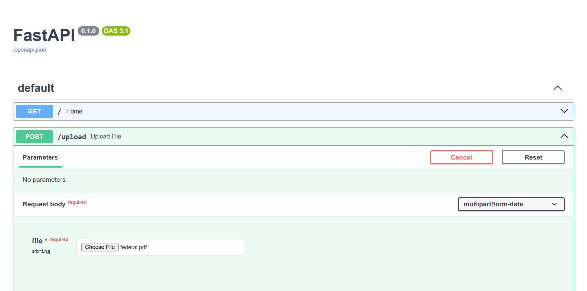

# Ask Anything API - RAG Document Chatbot

A FastAPI-based AI backend application that allows users to upload PDF documents and ask questions based on the uploaded document content.

## Features

- FastAPI backend
- PDF upload support
- Text extraction from PDF files
- Document chunking
- OpenAI embeddings
- FAISS vector search
- Question answering using document context
- Swagger API documentation

## Tech Stack

- Python
- FastAPI
- OpenAI API
- FAISS
- PyPDF
- NumPy
- Uvicorn
- Render Deployment

## Project Structure

```text
ask-anything-api/
│
├── main.py
├── requirements.txt
└── README.md


Title
# RAG Document Chatbot API
What this project does
## Overview
This project is a FastAPI-based backend application that allows users to upload PDF documents and ask questions based on the document content using AI.
It uses Retrieval-Augmented Generation (RAG) with OpenAI embeddings and FAISS vector search.


## API Endpoints

### 1. Home

**GET /**

Returns API status.

**Response:**
```json
{
  "message": "RAG Document Chatbot API is running"
}

POST /upload

Uploads a PDF file and processes it for question answering.


POST /upload

Uploads a PDF file and processes it for question answering.

3. Ask Question from Document

GET /ask-doc?q=your_question

Example:

/ask-doc?q=What is this document about?

Response:

{
  "question": "What is this document about?",
  "answer": "Generated answer from document"
}

👉 This is documentation.  
👉 You DO NOT run this.

---

## 6. How to run locally

```markdown
## Run Locally

1. Install dependencies:

```bash
python -m pip install -r requirements.txt
Set API key:
$env:OPENAI_API_KEY="your_api_key"
Run server:
python -m uvicorn main:app --reload
Open:

http://127.0.0.1:8000/docs


---

## 7. Live API

```markdown
## Live API

https://ask-anything-api.onrender.com

Swagger Docs:

https://ask-anything-api.onrender.com/docs


#####Updates


## API Endpoints

### 1. Home

**GET /**

Returns API status.

**Response:**
```json
{
  "message": "RAG Document Chatbot API is running"
}


Upload PDF

POST /upload

Uploads a PDF file, extracts text, splits it into chunks, generates embeddings, and stores them in a FAISS vector database.

Validation:

Only .pdf files are accepted
Returns error if no readable text is found

Response:

{
  "filename": "sample.pdf",
  "chunks_created": 25,
  "message": "PDF uploaded and indexed successfully"
}
3. Ask Question from Document

GET /ask-doc?q=your_question

Retrieves relevant document chunks using vector search and generates an AI response based on those chunks.

Example:

/ask-doc?q=What is this document about?

Response:

{
  "question": "What is this document about?",
  "answer": "The document explains...",
  "sources": [
    {
      "filename": "sample.pdf",
      "page": 2,
      "preview": "This section explains..."
    }
  ]
}
Error Responses

If no document is uploaded:

{
  "detail": "No document uploaded yet. Please upload a PDF first."
}

If invalid file:

{
  "detail": "Only PDF files are supported"
}

---

# 🔥 Add this (important — makes you look advanced)

## Add Architecture Section

```markdown
## Architecture

1. User uploads a PDF document
2. Text is extracted using PyPDF
3. Text is split into chunks
4. Each chunk is converted into embeddings using OpenAI
5. Embeddings are stored in FAISS vector index
6. User query is converted into embedding
7. FAISS retrieves most relevant chunks
8. LLM generates answer using retrieved context
9. API returns answer with source citations
🔥 Update Features section

Replace with:

## Features

- PDF upload and processing
- Text extraction and chunking
- Semantic search using FAISS
- OpenAI embeddings integration
- AI-powered question answering
- Source citation with page references
- Error handling and validation
- Deployed API with Swagger UI


## Screenshots
!### UI Interface
 

### Answer with Sources
